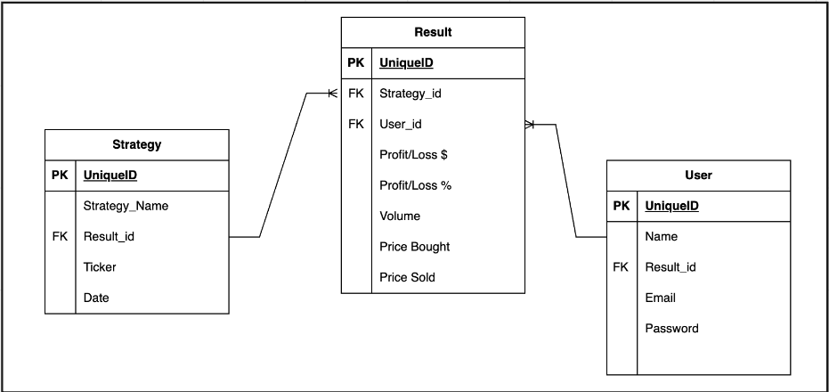
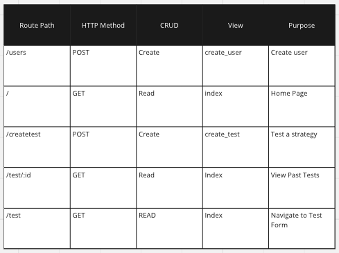

# Description
StratTester is a user-friendly web application designed for stock enthusiasts and traders. It provides a seamless platform to stay updated on the latest stock news and test various intra-day trading strategies.
# Tech Stack
Django
React
Python
Javascript
pandas
# ERD

# RESTful Routing Chart

# Wireframes
# User Stories
# Goals
## MVP
## Stretch Goals