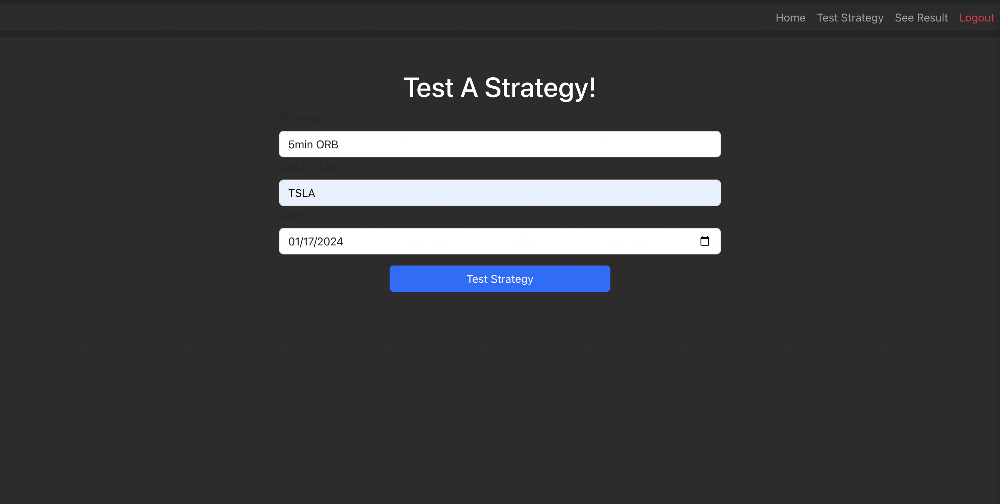

# Description
Meet StratTester, the ultimate ally for traders. Stay informed on stock news while supercharging your strategy testing. Effortlessly save time with streamlined backtesting, optimizing your performance. Elevate your trading game with efficiency and precision—welcome to a new era of strategic success with StratTester.
# Tech Stack
Django |
React |
Python |
Javascript |
PostgreSQL | 
React-Bootstrap 
# ERD

# RESTful Routing Chart

# Wireframes

# Walk-Through of the App
Due to the restrictions of the 3rd party APIs that are used in this project, I cannot deploy it. However, I can walk you through the user stories.

### User Stories:
- AAU I want to be able to log in and out of my account
- AAU I want to be able to current news
- AAU I want to be able to select a stock, a trading strategy and date then see what the result (profit/loss) would have been
- AAU I want to view my past tests

# Goals
## MVP
- Display Stock News on home page
- Create a new test
- View data/results of that test
- View past tests

## Stretch Goals
- Choose number of shares to trade with
- Display a chart of the stock tested on the day tested
- Let user define their own Stop Loss and Price Target
- Aggregate data of users past tests
- Filter and Sort users past tests
- Test over multiple days
- Filter news by ticker
- Convert JavaScript -> TypeScript

## Daily Sprints
1. Research/Education on unfamiliar tech
2. Navbar, Stub-up each page, setup User Auth
3. Make navbar conditional on user, setup the APIs, get API data to render
4. Work on create_test form functionality & results page
5. Work on 'My Tests' page
6. Select stretch goal(s) to work on
7. Work on CSS